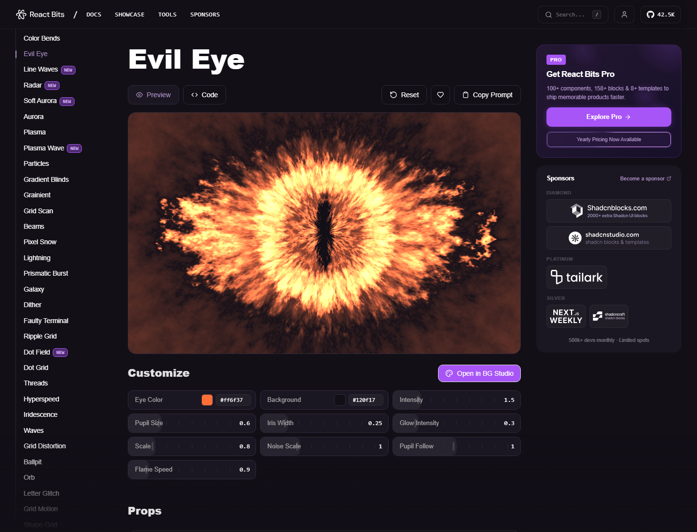

# Evil Eye Background Prompt



## What It Is

这是一个用于集成 React Bits `EvilEye` 背景组件的提示词。它提供了完整 React 组件源码、CSS、props 表和集成步骤，适合把一个 WebGL shader 风格的“火焰眼睛”背景加入 React 页面。

## Source

- Source website: [React Bits - Evil Eye](https://www.reactbits.dev/backgrounds/evil-eye?glowIntensity=0.3&flameSpeed=0.9)
- Preview: captured from the source page for reference.

## Best For

- 想学习 React + WebGL/OGL 组件集成的新手。
- 想给登录页、游戏页、暗黑风品牌页、音乐视觉页添加动态背景。
- 想快速获得可调参数的 shader 组件，而不是从零写 GLSL。

## Beginner Usage

1. 在你的 React 项目里安装依赖：

```powershell
npm install ogl
```

2. 打开 [`prompt.md`](prompt.md)，复制完整提示词。
3. 粘贴给 AI，并说明你的项目使用 JavaScript 还是 TypeScript。
4. 让 AI 创建两个文件：`EvilEye.jsx` 和 `EvilEye.css`。
5. 在页面中这样使用：

```jsx
import EvilEye from './EvilEye';

export default function Hero() {
  return (
    <section style={{ position: 'relative', minHeight: '100vh', overflow: 'hidden' }}>
      <EvilEye glowIntensity={0.3} flameSpeed={0.9} />
      <div style={{ position: 'relative', zIndex: 1 }}>
        Your content here
      </div>
    </section>
  );
}
```

## Newbie Notes

- 这个组件依赖 WebGL，低端设备上要注意性能。
- 如果页面黑屏，先检查容器是否有明确高度。
- 如果鼠标跟随太强，降低 `pupilFollow`。
- 如果火焰太亮，降低 `intensity` 或 `glowIntensity`。
- 如果你用 TypeScript，让 AI 把 props 类型补成 interface。

## Files

- [`prompt.md`](prompt.md): original prompt text.
- [`assets/source-preview.png`](assets/source-preview.png): source page preview.
