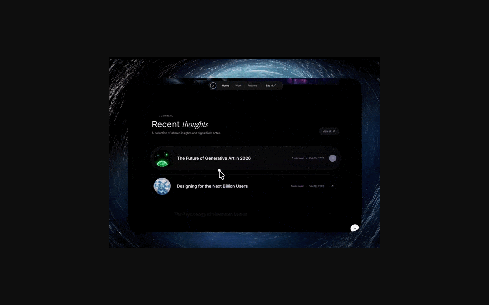

# quietpress Cosmic Hero Prompt



## What It Is

这是一个用于生成单屏品牌 Hero 的前端提示词。它以虚构黑胶唱片厂牌 `quietpress` 为主题，要求使用 React、TypeScript、Tailwind CSS、Vite 和 lucide-react，实现全屏视频背景、boomerang 视频循环、liquid glass 按钮、移动端导航和 Now Playing 播放卡片。

## Source

- Source asset: [MotionSites cosmic portfolio preview GIF](https://motionsites.ai/assets/hero-portfolio-cosmic-preview-BpvWJ3Nc.gif)
- Preview: screenshot captured from the source GIF URL for reference.

## Best For

- 想学习“一个屏幕就很抓人”的品牌首页。
- 想做音乐、唱片、艺术家、播客、展览或创意工作室官网。
- 想练习视频背景、玻璃拟态、动效入场和响应式 Header。
- 想让 AI 生成更像真实设计稿的 Hero，而不是普通营销首屏。

## Beginner Usage

1. 新建 React + Vite + TypeScript 项目。
2. 安装图标库：

```powershell
npm install lucide-react
```

3. 打开 [`prompt.md`](prompt.md)，复制完整提示词。
4. 粘贴给 AI，并说明你希望生成到哪个文件，例如 `src/App.tsx` 和 `src/index.css`。
5. 生成后运行：

```powershell
npm run dev
```

6. 在浏览器检查：视频是否加载、移动端菜单是否可点、Now Playing 卡片是否不会遮挡标题。

## Copy Starter

```text
Use the prompt in prompt.md to create a single-screen React + TypeScript hero. Keep the implementation beginner-friendly, split the video background into a reusable component, and explain where each file should go.
```

## Newbie Notes

- 该 prompt 使用外部 CloudFront 视频链接，若加载慢，可先替换成本地 mp4。
- `liquid-glass` 依赖 `backdrop-filter`，某些浏览器或父级 transform 会影响效果。
- prompt 里特别强调 `animation-fill-mode: backwards`，不要随手改成 `forwards`。
- 这是静态页面，不需要 Supabase、数据库或后端。

## Files

- [`prompt.md`](prompt.md): original prompt text.
- [`assets/source-preview.png`](assets/source-preview.png): source GIF preview screenshot.
