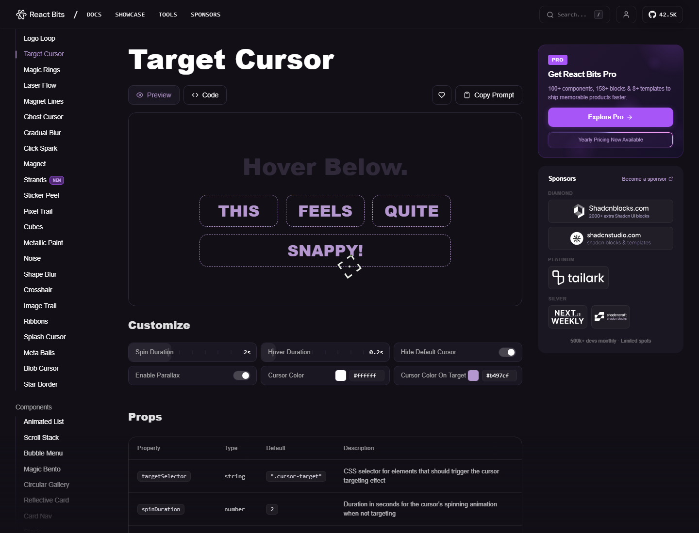

# Target Cursor Landing Prompt / 暗色作品集首页提示词



## What It Is / 这是什么

这是一个适合生成暗色高级作品集首页的前端提示词。它覆盖 React、Vite、Tailwind CSS、TypeScript、GSAP、Framer Motion、hls.js 等实现细节，能帮助 AI 生成带加载页、视频 Hero、动效导航、作品 Bento Grid、Journal、Parallax Gallery、Stats 和 Footer 的完整单页作品集。
This is a frontend prompt for generating a dark, polished portfolio landing page. It covers React, Vite, Tailwind CSS, TypeScript, GSAP, Framer Motion, hls.js, a loading screen, video hero, animated navigation, bento project grid, journal section, parallax gallery, stats, and footer.

## Source / 来源

- Source website / 来源网站：[React Bits - Target Cursor](https://www.reactbits.dev/animations/target-cursor)
- Preview / 预览：captured from the source page for reference. 预览图来自来源页面截图，仅供理解效果。

## Best For / 适合谁

- 想学习“热门作品集 landing page”结构的新手。Beginners learning modern portfolio landing page structure.
- 想让 AI 一次性生成完整页面，而不是只生成一个小组件。Builders who want a complete page instead of a tiny component.
- 想复刻暗色、玻璃质感、视频背景、GSAP 入场动画和滚动视差。Designers who like dark UI, glass effects, video backgrounds, GSAP entrance animation, and scroll parallax.
- 想把 React Bits 的交互灵感融入个人作品集。Anyone remixing React Bits interaction ideas into a personal portfolio.

## Beginner Usage / 小白使用方法

1. 新建 React + Vite + TypeScript 项目。Create a React + Vite + TypeScript project.
2. 安装 prompt 里提到的依赖。Install the dependencies mentioned in the prompt:

```powershell
npm install gsap framer-motion hls.js react-router-dom tailwindcss-animate
```

3. 打开 [`prompt.md`](prompt.md)，复制完整内容。Open [`prompt.md`](prompt.md) and copy the full prompt.
4. 粘贴给 AI，并补充你的名字、作品集项目名、头像/作品图片来源。Paste it into your AI tool and add your name, portfolio title, avatar, and project image sources.
5. 要求 AI 先生成文件结构，再分文件实现。Ask the AI to create the file structure first, then implement file by file.
6. 生成后重点检查：HLS 视频是否可播放、移动端文字是否溢出、GSAP ScrollTrigger 是否正确清理。After generation, verify HLS playback, mobile text wrapping, and GSAP ScrollTrigger cleanup.

## Copy Starter / 可复制开场白

```text
Use the prompt in prompt.md to build this landing page in my existing React + Vite + Tailwind project. Keep the existing folder style, make it responsive, and verify the page works on desktop and mobile.
```

```text
请使用 prompt.md 中的提示词，在我现有的 React + Vite + Tailwind 项目里实现这个页面。请遵循当前目录结构，保证桌面端和移动端都可用。
```

## Customization Ideas / 改造建议

- 把姓名、城市、角色文案换成自己的。Replace the name, city, and role copy.
- 用自己的项目图替换 Bento Grid 图片。Swap bento grid images with your own work.
- 把导航改为真实锚点：Home / Work / Resume / Contact。Turn the nav into real section anchors.
- 如果项目没有视频素材，先用静态海报图替代 HLS 视频。Use a poster image if you do not have an HLS video source.

## Files / 文件

- [`prompt.md`](prompt.md): original prompt text / 原始提示词。
- [`assets/source-preview.png`](assets/source-preview.png): source page preview / 来源页预览图。
